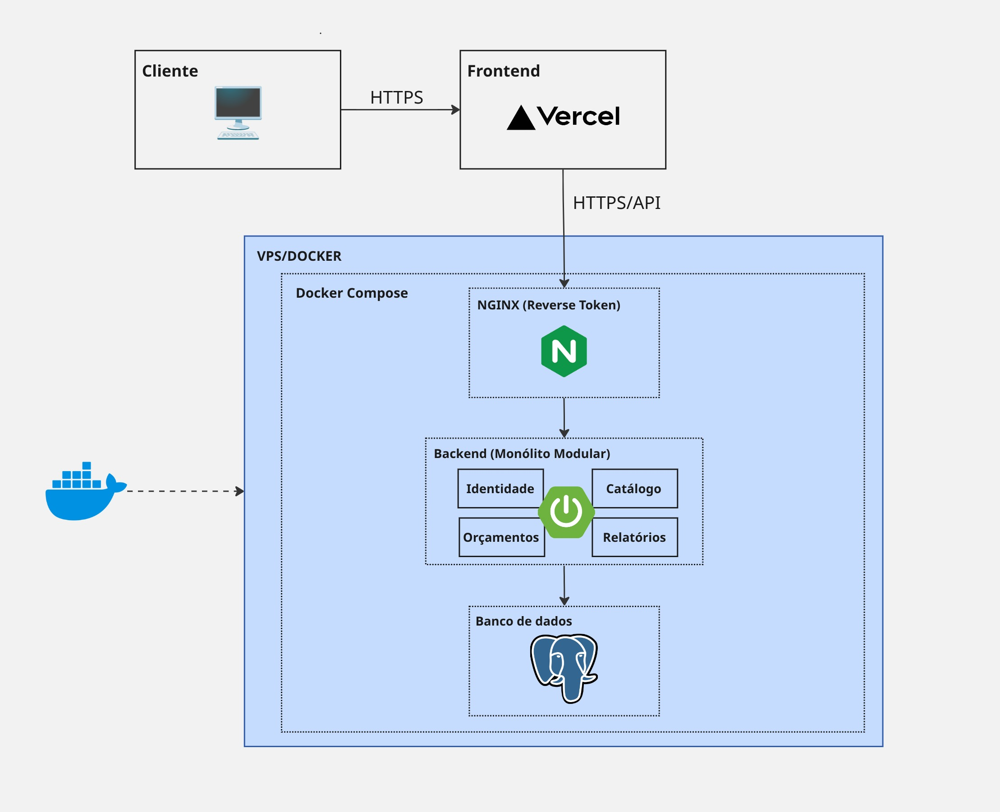

# 3. Arquitetura e Engenharia

## 4.1 Stack Tecnológica

| Camada                     | Tecnologia Definida                                | Por que usar no BuildPrice?                                                                                                                                                                                                                                                                    |
| -------------------------- | -------------------------------------------------- | ---------------------------------------------------------------------------------------------------------------------------------------------------------------------------------------------------------------------------------------------------------------------------------------------- |
| **Backend (Lógica e API)** | Java + Spring Boot                                 | Extremamente sólido para lidar com as regras da SINAPI. O Java possui a classe nativa `BigDecimal`, que resolve problemas de arredondamento financeiro, garantindo que as contas de Custo e BDI batam até o último centavo.                                                                    |
| **Banco de Dados**         | PostgreSQL                                         | A tabela SINAPI é puramente relacional (Composições dependem de Insumos), e o orçamento precisa de hierarquia (Etapas > Itens). O PostgreSQL garante integridade dos dados.                                                                                                                    |
| **Frontend (Interface)**   | React + JavaScript                                 | Aplicação de página única (SPA) rápida e reativa. Como será usado JavaScript puro (sem TypeScript), é necessária atenção redobrada ao validar os tipos de dados (texto vs. número) antes de enviar os formulários para o backend em Java.                                                      |
| **Infraestrutura**         | VPS + Docker (backend e banco) + Vercel (frontend) | Frontend hospedado na Vercel para aproveitar CDN global, deploy automático via Git e HTTPS/build gerenciados, liberando a VPS para focar em backend e banco — as partes de maior consumo de CPU/memória. Frontend e backend em domínios diferentes exigem configuração de CORS no Spring Boot. |
| **Proxy / SSL**            | Nginx + Certbot (Let's Encrypt)                    | Proxy reverso na VPS, direcionando tráfego HTTPS (443) para a porta interna do backend, com certificado SSL gratuito e renovação automática — essencial para tráfego de login/JWT.                                                                                                             |
| **CI/CD**                  | GitHub Actions (pipeline mínimo)                   | Build + execução automática de testes a cada push na branch principal. O deploy para a VPS pode ser feito manualmente ou via script simples. Pipelines elaborados (múltiplos ambientes, blue-green etc.) ficam para uma fase mais madura do produto.                                           |

### Bibliotecas Críticas

* **Exportação de Excel — Apache POI:** biblioteca padrão do ecossistema Java para gerar planilhas (`.xlsx`), permitindo construir o arquivo já com fórmulas (ex.: soma da etapa) e formatação prontas para o engenheiro baixar.

* **Geração de PDF — iText ou JasperReports:** para orçamentos com dezenas de páginas, tabelas e Curva ABC, o backend compila o PDF e entrega o arquivo pronto para o frontend exibir ou baixar.

* **Persistência de Dados — Spring Data JPA (com Hibernate):** facilita a modelagem em árvore das Etapas do Orçamento (EAP), permitindo buscar a estrutura de grupos/subgrupos de forma otimizada no banco.

---

## 4.2 Diagramas de Sistema

* Utilizar **C4 Model** ou **UML** para representar como os serviços se conectam.
* Os diagramas devem ser produzidos conforme os módulos forem definidos, incluindo inicialmente:

    * **API de Orçamento**;
    * **Módulo de Importação SINAPI**;
    * **Módulo de Geração de PDF/Excel**.
